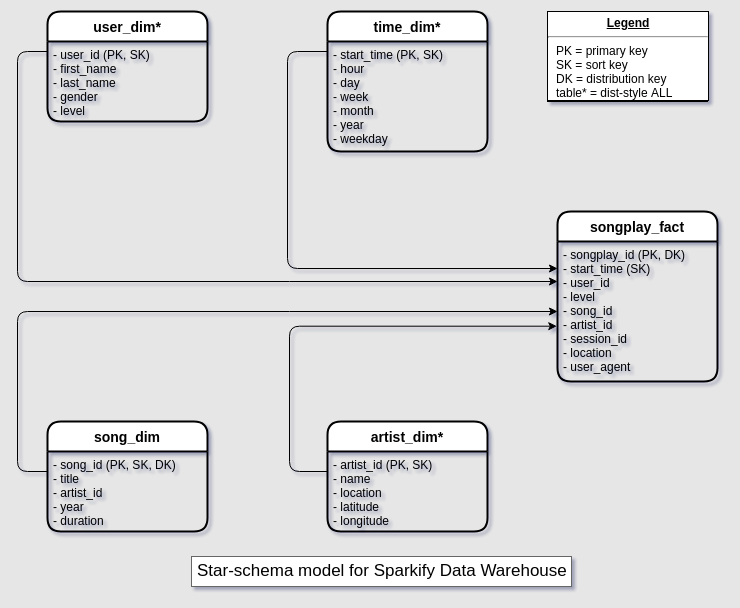

## Project description:
In this project, ETL pipeline is built on cloud using AWS Redshift and populated via Apache Airflow. The star-schema was used for dimensional model. The data consists of listening event logs from a music app Sparkify and data about songs, artists, and users.
The process looks like the following:
1. Stage the logs from S3 to staging tables in Redshift using a custom Airflow Operator
2. Move data from staging tables to our star schema tables using PostgresOperator
3. Check Data quality on the tables using custom Airflow operator

The DW schema is illustrated below:

The Airflow pipeline illustrated below:

## Installation instructions:
Following installation instructions from:
https://airflow.readthedocs.io/en/latest/installation.html
Prerequisites:
On Debian based Linux OS:

sudo apt-get update
sudo apt-get install build-essential

Installing just airflow

pip install \
 apache-airflow==1.10.10 \
 --constraint \
        https://raw.githubusercontent.com/apache/airflow/1.10.10/requirements/requirements-python3.6.txt

Verified with: `airflow version` that 1.10.10 is installed

## Run instructions:
Copy the dags and operators to ~/airflow/dags and ~/airflow/plugins or wherever your airflow home directory is located.
In this repo, this is done via the copy_dags.sh script. This should be run from current directory.

Then, initialize meta-db to store airflow dag runs info:
Run `airflow initdb` (note official doc says: `airflow db init` which is not a valid command)
Run `airflow webserver` to start the airflow UI and `airflow scheduler` to run the scheduler to run the pipeline.